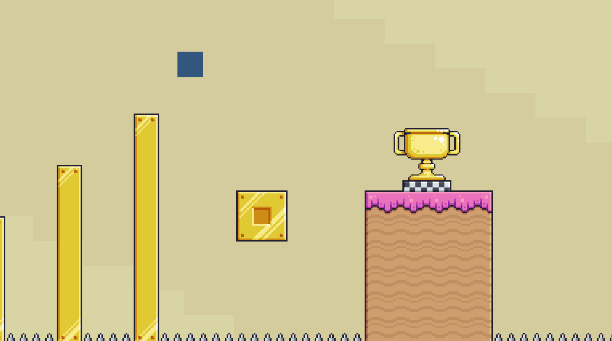

# GameDev-Assignment-1

A 2D platformer made in Unity: run and jump across a level, collect items, avoid enemies and traps, and reach the finish line.



## Gameplay

- Goal: get from the start of the level to the finish line without dying.
- Collectables: coins, diamonds, and stars, optional to pick up along the way.
- Hazards: enemies that chase you once you get close, and traps that kill you on touch.
- Level elements: moving platforms and an elevator that carry the player between sections.
- On death or on reaching the finish line, the level restarts automatically after a short delay.

## Controls

| Key | Action |
|-----|--------|
| A / Left Arrow | Move left |
| D / Right Arrow | Move right |
| Space | Jump |

## Getting Started

1. Unity version: `6000.3.20f1`
2. Clone: `git clone https://github.com/ShlomiGanon/GameDev-Assignment-1.git`
3. Open the folder in Unity Hub.
4. Open `Assets/Scenes/FinalScene.unity`.
5. Press Play.

## Project Structure

```
Assets/
├── Scenes/                 # FinalScene, the only scene in the project
├── Scripts/                # player movement/input, enemy AI, collectables, moving platforms, game manager
├── Prefabs/                # player, enemy, collectables, elevator
├── Pixel Adventure 1/      # items, terrain, and trap sprites
└── TileMaps/               # tile palettes and tilemap data for the terrain and traps
```

## Credits

- Developers: Shlomi Ganon, Maor Buchbut
- Course: Videogame Development
- Lecturer: EllaLuna
